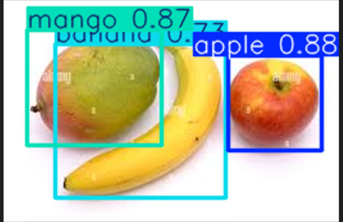

# FoodSnap AI 

 **FOODSNAP-AI** 

FoodSnap AI is an advanced AI-powered tool designed to revolutionize the way users track their nutrition.This smart calorie calculator uses image recognition to instantly identify multiple food items in a single image and provide precise calorie estimates per 100 grams—just by snapping a picture!


## Table of Contents

1.  [Features](#Features)
2.  [Working](#Working)
2.  [Installation](#Installation)
3.  [Results](#Results)

---

## Features

- ### AI-Powered Food Identification:
Recognizes variety of food items.
- ### Calorie & Nutrient Breakdown:
Instantly estimates calories, protein, fat, carbohydrates, dietary fibre and sugar.
- ### Multiple food detection:
Detects and identifies multiple food items present with in a single image.

## Working

- ### Snap a Photo:
Capture an image of your meal using your smartphone.
- ### AI Recognition:
Our advanced model detects and identifies food items.
- ### Instant Calorie Analysis:
Get an estimated calorie count along with macronutrient details.


## Installation

Follow these steps to set up the project on your local machine:

### Steps

1. Clone the repository:
```bash
https://github.com/Muhammad-anzil-pm/foodsnap-ai.git
```

2. Install dependencies
```bash
pip install -r requirement.txt
```

3. Run the project:
```bash
python main.py
```
## Results

### Detected Food Items Preview



### Terminal Output


